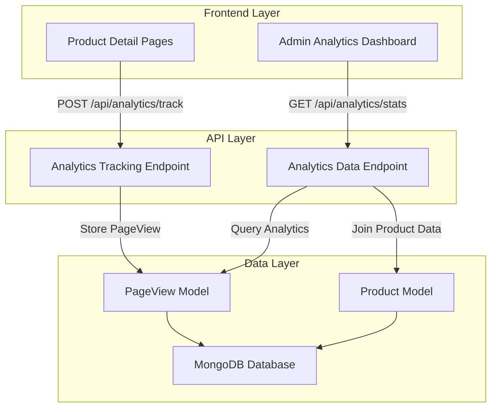

# Design Document: Admin Analytics Dashboard

## Overview

The Admin Analytics Dashboard is a comprehensive analytics system that tracks user interactions across the website and provides administrators with actionable insights into visitor behavior and product performance. The system consists of three main components: a backend analytics tracking API, a database model for storing page view data, and a frontend dashboard for displaying analytics insights.

The system follows a non-intrusive tracking approach where analytics data collection does not interfere with user experience. All tracking is performed asynchronously, and failures in the analytics system do not affect core website functionality.

### Key Features

- **Real-time Page View Tracking**: Captures all page visits with timestamps and context
- **Product Performance Analytics**: Tracks product detail page views to measure popularity
- **Visitor Statistics**: Provides insights into traffic patterns over different time periods
- **Admin Dashboard Integration**: Seamlessly integrates with existing admin interface
- **Performance Optimized**: Uses efficient database queries and caching strategies

## Architecture

The analytics system follows a three-tier architecture:



### Data Flow

1. **Tracking Flow**: User visits → Frontend tracking → API endpoint → Database storage
2. **Analytics Flow**: Admin request → API query → Database aggregation → Dashboard display
3. **Error Handling**: All failures are logged but do not interrupt user experience

## Components and Interfaces

### Backend Components

#### PageView Model (`backend/src/models/PageView.ts`)

```typescript
interface IPageView extends Document {
  timestamp: Date;
  pageType: 'home' | 'shop' | 'product' | 'contact' | 'faq' | 'cart' | 'checkout' | 'customize';
  productId?: mongoose.Types.ObjectId;
  sessionId: string;
  userAgent?: string;
  ipAddress?: string;
  createdAt: Date;
}
```

**Key Features:**
- Efficient indexing for time-based queries
- Optional product ID for product-specific tracking
- Session tracking for user journey analysis
- Metadata fields for enhanced analytics

#### Analytics Controller (`backend/src/controllers/analyticsController.ts`)

```typescript
// Track page view
POST /api/analytics/track
Request: {
  pageType: string;
  productId?: string;
  sessionId: string;
}
Response: { success: boolean; message: string }

// Get analytics statistics
GET /api/analytics/stats
Response: {
  visitorStats: {
    totalVisits: number;
    last24Hours: number;
    last7Days: number;
  };
  productStats: Array<{
    productId: string;
    productName: string;
    productImage: string;
    viewCount: number;
  }>;
}
```

#### Analytics Routes (`backend/src/routes/analytics.ts`)

- **Public Endpoint**: `POST /api/analytics/track` - For tracking page views
- **Protected Endpoint**: `GET /api/analytics/stats` - For retrieving analytics data (admin only)

### Frontend Components

#### Analytics Tracking Service (`frontend/lib/analyticsService.ts`)

```typescript
interface TrackingData {
  pageType: string;
  productId?: string;
  sessionId: string;
}

class AnalyticsService {
  static async trackPageView(data: TrackingData): Promise<void>
  static generateSessionId(): string
  static getSessionId(): string
}
```

#### Admin Analytics Page (`frontend/app/admin/analytics/page.tsx`)

**Component Structure:**
- **VisitorStatsCard**: Displays total visits, 24h visits, 7-day visits
- **ProductStatsTable**: Shows top products with view counts
- **LoadingStates**: Skeleton loaders during data fetching
- **ErrorHandling**: Graceful error display with retry options

#### Analytics Integration Hook (`frontend/hooks/useAnalytics.ts`)

```typescript
interface AnalyticsData {
  visitorStats: VisitorStats;
  productStats: ProductStats[];
  isLoading: boolean;
  error: string | null;
  refetch: () => void;
}

export function useAnalytics(): AnalyticsData
```

## Data Models

### PageView Schema

```typescript
const PageViewSchema = new Schema<IPageView>({
  timestamp: {
    type: Date,
    default: Date.now,
    required: true,
    index: true
  },
  pageType: {
    type: String,
    required: true,
    enum: ['home', 'shop', 'product', 'contact', 'faq', 'cart', 'checkout', 'customize'],
    index: true
  },
  productId: {
    type: Schema.Types.ObjectId,
    ref: 'Product',
    sparse: true,
    index: true
  },
  sessionId: {
    type: String,
    required: true,
    index: true
  },
  userAgent: {
    type: String,
    maxlength: 500
  },
  ipAddress: {
    type: String,
    maxlength: 45 // IPv6 max length
  }
}, {
  timestamps: true
});
```

### Database Indexes

```typescript
// Compound indexes for efficient analytics queries
PageViewSchema.index({ timestamp: -1, pageType: 1 });
PageViewSchema.index({ productId: 1, timestamp: -1 });
PageViewSchema.index({ sessionId: 1, timestamp: -1 });

// TTL index for data retention (optional)
PageViewSchema.index({ timestamp: 1 }, { expireAfterSeconds: 31536000 }); // 1 year
```

### Analytics Data Aggregation

#### Visitor Statistics Query

```typescript
// Total visits (all time)
const totalVisits = await PageView.countDocuments();

// Last 24 hours
const last24Hours = await PageView.countDocuments({
  timestamp: { $gte: new Date(Date.now() - 24 * 60 * 60 * 1000) }
});

// Last 7 days
const last7Days = await PageView.countDocuments({
  timestamp: { $gte: new Date(Date.now() - 7 * 24 * 60 * 60 * 1000) }
});
```

#### Product Statistics Aggregation

```typescript
const productStats = await PageView.aggregate([
  { $match: { pageType: 'product', productId: { $exists: true } } },
  { $group: { _id: '$productId', viewCount: { $sum: 1 } } },
  { $sort: { viewCount: -1 } },
  { $limit: 10 },
  {
    $lookup: {
      from: 'products',
      localField: '_id',
      foreignField: '_id',
      as: 'product'
    }
  },
  { $unwind: '$product' },
  {
    $project: {
      productId: '$_id',
      productName: '$product.name',
      productImage: '$product.image',
      viewCount: 1
    }
  }
]);
```

## Integration Approach

### Product Detail Page Integration

The tracking integration in the product detail page follows these principles:

1. **Non-blocking**: Analytics calls are made asynchronously
2. **Error-resilient**: Tracking failures don't affect page functionality
3. **Session-aware**: Uses consistent session IDs for user journey tracking
4. **Single-track**: Prevents duplicate tracking on the same page load

#### Implementation in Product Detail Page

```typescript
// In frontend/app/product/[id]/page.tsx
useEffect(() => {
  const trackPageView = async () => {
    try {
      await AnalyticsService.trackPageView({
        pageType: 'product',
        productId: id,
        sessionId: AnalyticsService.getSessionId()
      });
    } catch (error) {
      // Log error but don't interrupt user experience
      console.warn('Analytics tracking failed:', error);
    }
  };

  // Track after component mounts and product loads
  if (product) {
    trackPageView();
  }
}, [product, id]);
```

### Session Management

```typescript
// Session ID generation and persistence
class AnalyticsService {
  private static SESSION_KEY = 'analytics_session_id';
  
  static getSessionId(): string {
    let sessionId = localStorage.getItem(this.SESSION_KEY);
    if (!sessionId) {
      sessionId = this.generateSessionId();
      localStorage.setItem(this.SESSION_KEY, sessionId);
    }
    return sessionId;
  }
  
  static generateSessionId(): string {
    return `${Date.now()}-${Math.random().toString(36).substr(2, 9)}`;
  }
}
```

## Data Aggregation and Query Strategies

### Performance Optimization Strategies

#### 1. Database Indexing Strategy

```typescript
// Primary indexes for analytics queries
PageViewSchema.index({ timestamp: -1 }); // Time-based queries
PageViewSchema.index({ pageType: 1, timestamp: -1 }); // Page type filtering
PageViewSchema.index({ productId: 1, timestamp: -1 }); // Product analytics
PageViewSchema.index({ sessionId: 1 }); // Session tracking
```

#### 2. Aggregation Pipeline Optimization

```typescript
// Optimized product statistics pipeline
const productStatsPipeline = [
  // Match only product page views
  { $match: { pageType: 'product', productId: { $exists: true, $ne: null } } },
  
  // Group by product and count views
  { $group: { _id: '$productId', viewCount: { $sum: 1 } } },
  
  // Sort by view count (descending)
  { $sort: { viewCount: -1 } },
  
  // Limit to top 10
  { $limit: 10 },
  
  // Join with product collection
  {
    $lookup: {
      from: 'products',
      localField: '_id',
      foreignField: '_id',
      as: 'product',
      pipeline: [
        { $project: { name: 1, image: 1, category: 1 } } // Only needed fields
      ]
    }
  },
  
  // Unwind and project final structure
  { $unwind: '$product' },
  {
    $project: {
      productId: '$_id',
      productName: '$product.name',
      productImage: '$product.image',
      productCategory: '$product.category',
      viewCount: 1,
      _id: 0
    }
  }
];
```

#### 3. Caching Strategy

```typescript
// Redis caching for frequently accessed analytics
interface CacheConfig {
  visitorStats: { ttl: 300 }; // 5 minutes
  productStats: { ttl: 600 }; // 10 minutes
  dailyStats: { ttl: 3600 }; // 1 hour
}

class AnalyticsCache {
  static async getVisitorStats(): Promise<VisitorStats | null> {
    const cached = await redis.get('analytics:visitor_stats');
    return cached ? JSON.parse(cached) : null;
  }
  
  static async setVisitorStats(stats: VisitorStats): Promise<void> {
    await redis.setex('analytics:visitor_stats', 300, JSON.stringify(stats));
  }
}
```

### Query Performance Considerations

1. **Time-based Partitioning**: Consider partitioning PageView collection by month for large datasets
2. **Batch Processing**: Use aggregation pipelines instead of multiple queries
3. **Selective Projection**: Only fetch required fields in queries
4. **Connection Pooling**: Optimize database connection management
5. **Query Monitoring**: Implement slow query logging and monitoring

## UI/UX Design for Analytics Display

### Admin Analytics Page Layout

```
┌─────────────────────────────────────────────────────────────┐
│                     Admin Analytics Dashboard               │
├─────────────────────────────────────────────────────────────┤
│  📊 Visitor Statistics                                      │
│  ┌─────────────┐ ┌─────────────┐ ┌─────────────┐          │
│  │ Total Visits│ │ Last 24h    │ │ Last 7 Days │          │
│  │    1,234    │ │     45      │ │    312      │          │
│  └─────────────┘ └─────────────┘ └─────────────┘          │
├─────────────────────────────────────────────────────────────┤
│  🏆 Top Products                                            │
│  ┌─────────────────────────────────────────────────────────┐│
│  │ Rank │ Product Image │ Product Name    │ Views │ %     ││
│  ├──────┼───────────────┼─────────────────┼───────┼───────┤│
│  │  1   │ [IMG]         │ BMW M3 Art      │  156  │ 23.4% ││
│  │  2   │ [IMG]         │ Porsche 911     │  134  │ 20.1% ││
│  │  3   │ [IMG]         │ Ferrari F40     │  98   │ 14.7% ││
│  └─────────────────────────────────────────────────────────┘│
└─────────────────────────────────────────────────────────────┘
```

### Component Design Specifications

#### VisitorStatsCard Component

```typescript
interface VisitorStatsCardProps {
  title: string;
  value: number;
  icon: React.ReactNode;
  trend?: {
    value: number;
    isPositive: boolean;
  };
}

const VisitorStatsCard: React.FC<VisitorStatsCardProps> = ({
  title,
  value,
  icon,
  trend
}) => (
  <div className="bg-white dark:bg-zinc-900 rounded-2xl p-6 border border-zinc-200 dark:border-zinc-800">
    <div className="flex items-center justify-between mb-4">
      <div className="p-3 bg-blue-100 dark:bg-blue-900/20 rounded-xl">
        {icon}
      </div>
      {trend && (
        <div className={`flex items-center text-sm ${
          trend.isPositive ? 'text-green-600' : 'text-red-600'
        }`}>
          <span>{trend.isPositive ? '↗' : '↘'} {trend.value}%</span>
        </div>
      )}
    </div>
    <h3 className="text-2xl font-bold text-zinc-900 dark:text-white">
      {value.toLocaleString()}
    </h3>
    <p className="text-sm text-zinc-600 dark:text-zinc-400">{title}</p>
  </div>
);
```

#### ProductStatsTable Component

```typescript
interface ProductStatsTableProps {
  products: ProductStats[];
  isLoading: boolean;
  error?: string;
}

const ProductStatsTable: React.FC<ProductStatsTableProps> = ({
  products,
  isLoading,
  error
}) => {
  if (isLoading) return <ProductStatsTableSkeleton />;
  if (error) return <ErrorDisplay message={error} />;
  
  return (
    <div className="bg-white dark:bg-zinc-900 rounded-2xl border border-zinc-200 dark:border-zinc-800 overflow-hidden">
      <div className="p-6 border-b border-zinc-200 dark:border-zinc-800">
        <h2 className="text-xl font-bold text-zinc-900 dark:text-white">
          Top Products
        </h2>
      </div>
      <div className="overflow-x-auto">
        <table className="w-full">
          <thead className="bg-zinc-50 dark:bg-zinc-800/50">
            <tr>
              <th className="px-6 py-3 text-left text-xs font-medium text-zinc-500 uppercase tracking-wider">
                Rank
              </th>
              <th className="px-6 py-3 text-left text-xs font-medium text-zinc-500 uppercase tracking-wider">
                Product
              </th>
              <th className="px-6 py-3 text-left text-xs font-medium text-zinc-500 uppercase tracking-wider">
                Views
              </th>
              <th className="px-6 py-3 text-left text-xs font-medium text-zinc-500 uppercase tracking-wider">
                Share
              </th>
            </tr>
          </thead>
          <tbody className="divide-y divide-zinc-200 dark:divide-zinc-800">
            {products.map((product, index) => (
              <ProductStatsRow
                key={product.productId}
                rank={index + 1}
                product={product}
                totalViews={products.reduce((sum, p) => sum + p.viewCount, 0)}
              />
            ))}
          </tbody>
        </table>
      </div>
    </div>
  );
};
```

### Loading States and Error Handling

#### Skeleton Loading Components

```typescript
const VisitorStatsCardSkeleton = () => (
  <div className="bg-white dark:bg-zinc-900 rounded-2xl p-6 border border-zinc-200 dark:border-zinc-800 animate-pulse">
    <div className="flex items-center justify-between mb-4">
      <div className="w-12 h-12 bg-zinc-200 dark:bg-zinc-700 rounded-xl"></div>
      <div className="w-16 h-4 bg-zinc-200 dark:bg-zinc-700 rounded"></div>
    </div>
    <div className="w-20 h-8 bg-zinc-200 dark:bg-zinc-700 rounded mb-2"></div>
    <div className="w-24 h-4 bg-zinc-200 dark:bg-zinc-700 rounded"></div>
  </div>
);

const ProductStatsTableSkeleton = () => (
  <div className="bg-white dark:bg-zinc-900 rounded-2xl border border-zinc-200 dark:border-zinc-800">
    <div className="p-6 border-b border-zinc-200 dark:border-zinc-800">
      <div className="w-32 h-6 bg-zinc-200 dark:bg-zinc-700 rounded animate-pulse"></div>
    </div>
    <div className="p-6 space-y-4">
      {[...Array(5)].map((_, i) => (
        <div key={i} className="flex items-center space-x-4 animate-pulse">
          <div className="w-8 h-8 bg-zinc-200 dark:bg-zinc-700 rounded"></div>
          <div className="w-16 h-16 bg-zinc-200 dark:bg-zinc-700 rounded-lg"></div>
          <div className="flex-1 space-y-2">
            <div className="w-32 h-4 bg-zinc-200 dark:bg-zinc-700 rounded"></div>
            <div className="w-24 h-3 bg-zinc-200 dark:bg-zinc-700 rounded"></div>
          </div>
          <div className="w-16 h-4 bg-zinc-200 dark:bg-zinc-700 rounded"></div>
          <div className="w-12 h-4 bg-zinc-200 dark:bg-zinc-700 rounded"></div>
        </div>
      ))}
    </div>
  </div>
);
```

### Responsive Design Considerations

1. **Mobile Layout**: Stack visitor stats cards vertically on mobile
2. **Table Responsiveness**: Horizontal scroll for product stats table on small screens
3. **Touch Interactions**: Ensure adequate touch targets for mobile users
4. **Loading Performance**: Implement progressive loading for large datasets
5. **Accessibility**: Proper ARIA labels and keyboard navigation support

## Error Handling

### Frontend Error Handling Strategy

```typescript
// Error boundary for analytics components
class AnalyticsErrorBoundary extends React.Component<
  { children: React.ReactNode },
  { hasError: boolean; error?: Error }
> {
  constructor(props: { children: React.ReactNode }) {
    super(props);
    this.state = { hasError: false };
  }

  static getDerivedStateFromError(error: Error) {
    return { hasError: true, error };
  }

  componentDidCatch(error: Error, errorInfo: React.ErrorInfo) {
    console.error('Analytics component error:', error, errorInfo);
    // Send error to monitoring service
  }

  render() {
    if (this.state.hasError) {
      return (
        <div className="p-6 text-center">
          <h2 className="text-lg font-semibold text-red-600 mb-2">
            Analytics Temporarily Unavailable
          </h2>
          <p className="text-zinc-600 mb-4">
            We're having trouble loading analytics data. Please try again later.
          </p>
          <button
            onClick={() => this.setState({ hasError: false })}
            className="px-4 py-2 bg-blue-600 text-white rounded-lg hover:bg-blue-700"
          >
            Retry
          </button>
        </div>
      );
    }

    return this.props.children;
  }
}
```

### Backend Error Handling

```typescript
// Analytics controller error handling
export const getAnalyticsStats = async (req: Request, res: Response) => {
  try {
    const [visitorStats, productStats] = await Promise.all([
      getVisitorStatistics(),
      getProductStatistics()
    ]);

    res.json({
      success: true,
      data: {
        visitorStats,
        productStats
      }
    });
  } catch (error) {
    console.error('Analytics stats error:', error);
    
    res.status(500).json({
      success: false,
      message: 'Failed to retrieve analytics data',
      error: process.env.NODE_ENV === 'development' ? error.message : undefined
    });
  }
};

// Tracking endpoint error handling
export const trackPageView = async (req: Request, res: Response) => {
  try {
    const { pageType, productId, sessionId } = req.body;

    // Validate required fields
    if (!pageType || !sessionId) {
      return res.status(400).json({
        success: false,
        message: 'Missing required fields: pageType and sessionId'
      });
    }

    // Validate pageType enum
    const validPageTypes = ['home', 'shop', 'product', 'contact', 'faq', 'cart', 'checkout', 'customize'];
    if (!validPageTypes.includes(pageType)) {
      return res.status(400).json({
        success: false,
        message: 'Invalid pageType'
      });
    }

    // Create page view record
    await PageView.create({
      pageType,
      productId: productId || undefined,
      sessionId,
      userAgent: req.get('User-Agent'),
      ipAddress: req.ip
    });

    res.json({
      success: true,
      message: 'Page view tracked successfully'
    });
  } catch (error) {
    console.error('Page view tracking error:', error);
    
    // Don't fail the request - analytics should be non-blocking
    res.json({
      success: false,
      message: 'Tracking failed but request processed'
    });
  }
};
```

## Correctness Properties

*A property is a characteristic or behavior that should hold true across all valid executions of a system-essentially, a formal statement about what the system should do. Properties serve as the bridge between human-readable specifications and machine-verifiable correctness guarantees.*

### Property Reflection

After analyzing all acceptance criteria, several properties can be consolidated to eliminate redundancy:

- Properties 1.1 and 1.2 (PageView storage and schema) can be combined into a comprehensive data storage property
- Properties 2.2, 2.3, and 2.4 (endpoint validation and response) can be unified into a single endpoint behavior property  
- Properties 4.1, 4.2, 4.3, and 4.4 (visitor statistics) can be combined into a comprehensive visitor analytics property
- Properties 5.1, 5.2, 5.3, and 5.6 (product analytics) can be unified into a single product analytics property

### Property 1: PageView Data Storage and Schema Integrity

*For any* valid page visit data (including page type, optional product ID, session ID, and timestamp), the PageView model SHALL store all provided fields correctly with proper data types, constraints, and indexing for efficient querying.

**Validates: Requirements 1.1, 1.2, 1.5**

### Property 2: Tracking Endpoint Request Processing

*For any* tracking request sent to /api/analytics/track, the endpoint SHALL validate the request data, create a PageView record when data is valid, return appropriate HTTP status codes and error messages for all scenarios, and handle the request without blocking other operations.

**Validates: Requirements 2.1, 2.2, 2.3, 2.4, 2.6**

### Property 3: Analytics System Data Creation

*For any* user page visit (regardless of page type), when tracking is triggered, the Analytics System SHALL create exactly one PageView record with accurate timestamp, page type, and product ID (when applicable).

**Validates: Requirements 1.3, 1.4**

### Property 4: Product Page Tracking Integration

*For any* product detail page load, the frontend SHALL send exactly one tracking request with correct product ID and page type, and SHALL continue to function normally even if tracking fails.

**Validates: Requirements 3.2, 3.4**

### Property 5: Visitor Statistics Calculation

*For any* set of PageView records with various timestamps, the Analytics System SHALL calculate accurate visitor statistics including total visits (all time), visits in the last 24 hours, and visits in the last 7 days based on the timestamp field.

**Validates: Requirements 4.1, 4.2, 4.3, 4.4**

### Property 6: Product Analytics Aggregation

*For any* collection of PageView records with product IDs, the Analytics System SHALL correctly aggregate view counts by product, rank products from highest to lowest view count, and join with product data to display accurate product information including name, image, and view count.

**Validates: Requirements 5.1, 5.2, 5.3, 5.6**

### Property 7: Input Validation and Error Handling

*For any* input data sent to analytics endpoints (valid or invalid), the system SHALL validate all data before processing, return descriptive error messages for invalid data, log detailed error information for debugging, and maintain data integrity even under concurrent load.

**Validates: Requirements 8.1, 8.3, 8.4, 8.6**

### Property 8: Error Resilience and Graceful Degradation

*For any* analytics system failure or unavailability, the frontend components SHALL continue to function normally, display appropriate error messages to administrators, and handle edge cases like missing product IDs without crashing.

**Validates: Requirements 8.2, 8.5**

## Testing Strategy

### Unit Testing

**Dual Testing Approach:**
- **Unit tests**: Verify specific examples, edge cases, and error conditions
- **Property tests**: Verify universal properties across all inputs
- Both are complementary and necessary for comprehensive coverage

**Property-Based Testing Configuration:**
- Minimum 100 iterations per property test (due to randomization)
- Each property test must reference its design document property
- Tag format: **Feature: admin-analytics-dashboard, Property {number}: {property_text}**

**Property Test Implementation:**
- Property 1: Generate random PageView data with various field combinations, verify correct storage and schema validation
- Property 2: Generate random valid/invalid tracking requests, verify endpoint behavior and responses
- Property 3: Generate random page visit scenarios, verify exactly one PageView record is created per visit
- Property 4: Generate random product page loads, verify tracking integration and error resilience
- Property 5: Generate PageView records with various timestamps, verify accurate visitor statistics calculations
- Property 6: Generate PageView records for different products, verify correct aggregation and ranking
- Property 7: Generate various input data types, verify validation and error handling
- Property 8: Generate failure scenarios, verify graceful degradation and error resilience

**Unit Test Focus Areas:**
- Specific examples of tracking requests and responses
- Edge cases like missing product IDs or invalid timestamps
- Error conditions and boundary values
- Integration points between frontend and backend components

#### Backend Unit Tests

```typescript
// Test analytics controller
describe('Analytics Controller', () => {
  describe('trackPageView', () => {
    it('should create page view record with valid data', async () => {
      const req = mockRequest({
        body: {
          pageType: 'product',
          productId: 'product123',
          sessionId: 'session123'
        }
      });
      const res = mockResponse();

      await trackPageView(req, res);

      expect(res.json).toHaveBeenCalledWith({
        success: true,
        message: 'Page view tracked successfully'
      });
    });

    it('should return error for missing required fields', async () => {
      const req = mockRequest({
        body: { pageType: 'product' } // missing sessionId
      });
      const res = mockResponse();

      await trackPageView(req, res);

      expect(res.status).toHaveBeenCalledWith(400);
      expect(res.json).toHaveBeenCalledWith({
        success: false,
        message: 'Missing required fields: pageType and sessionId'
      });
    });
  });

  describe('getAnalyticsStats', () => {
    it('should return visitor and product statistics', async () => {
      // Mock database responses
      jest.spyOn(PageView, 'countDocuments').mockResolvedValue(100);
      jest.spyOn(PageView, 'aggregate').mockResolvedValue([
        { productId: 'prod1', productName: 'Product 1', viewCount: 50 }
      ]);

      const req = mockRequest();
      const res = mockResponse();

      await getAnalyticsStats(req, res);

      expect(res.json).toHaveBeenCalledWith({
        success: true,
        data: {
          visitorStats: expect.objectContaining({
            totalVisits: expect.any(Number)
          }),
          productStats: expect.arrayContaining([
            expect.objectContaining({
              productId: expect.any(String),
              viewCount: expect.any(Number)
            })
          ])
        }
      });
    });
  });
});
```

#### Frontend Unit Tests

```typescript
// Test analytics service
describe('AnalyticsService', () => {
  beforeEach(() => {
    localStorage.clear();
    jest.clearAllMocks();
  });

  describe('trackPageView', () => {
    it('should send tracking data to API', async () => {
      const mockFetch = jest.fn().mockResolvedValue({
        ok: true,
        json: () => Promise.resolve({ success: true })
      });
      global.fetch = mockFetch;

      await AnalyticsService.trackPageView({
        pageType: 'product',
        productId: 'prod123',
        sessionId: 'session123'
      });

      expect(mockFetch).toHaveBeenCalledWith(
        expect.stringContaining('/api/analytics/track'),
        expect.objectContaining({
          method: 'POST',
          body: JSON.stringify({
            pageType: 'product',
            productId: 'prod123',
            sessionId: 'session123'
          })
        })
      );
    });

    it('should handle API errors gracefully', async () => {
      const mockFetch = jest.fn().mockRejectedValue(new Error('Network error'));
      global.fetch = mockFetch;

      // Should not throw
      await expect(
        AnalyticsService.trackPageView({
          pageType: 'product',
          sessionId: 'session123'
        })
      ).resolves.toBeUndefined();
    });
  });

  describe('session management', () => {
    it('should generate and persist session ID', () => {
      const sessionId = AnalyticsService.getSessionId();
      
      expect(sessionId).toBeTruthy();
      expect(localStorage.getItem('analytics_session_id')).toBe(sessionId);
    });

    it('should reuse existing session ID', () => {
      const firstSessionId = AnalyticsService.getSessionId();
      const secondSessionId = AnalyticsService.getSessionId();
      
      expect(firstSessionId).toBe(secondSessionId);
    });
  });
});
```

### Integration Testing

```typescript
// Test analytics API endpoints
describe('Analytics API Integration', () => {
  beforeEach(async () => {
    await PageView.deleteMany({});
  });

  describe('POST /api/analytics/track', () => {
    it('should track page view and store in database', async () => {
      const response = await request(app)
        .post('/api/analytics/track')
        .send({
          pageType: 'product',
          productId: 'prod123',
          sessionId: 'session123'
        });

      expect(response.status).toBe(200);
      expect(response.body.success).toBe(true);

      const pageView = await PageView.findOne({ sessionId: 'session123' });
      expect(pageView).toBeTruthy();
      expect(pageView.pageType).toBe('product');
      expect(pageView.productId.toString()).toBe('prod123');
    });
  });

  describe('GET /api/analytics/stats', () => {
    beforeEach(async () => {
      // Create test data
      await PageView.create([
        { pageType: 'product', productId: 'prod1', sessionId: 'session1' },
        { pageType: 'product', productId: 'prod1', sessionId: 'session2' },
        { pageType: 'home', sessionId: 'session3' }
      ]);
    });

    it('should return analytics statistics', async () => {
      const response = await request(app)
        .get('/api/analytics/stats')
        .set('Authorization', `Bearer ${adminToken}`);

      expect(response.status).toBe(200);
      expect(response.body.success).toBe(true);
      expect(response.body.data).toHaveProperty('visitorStats');
      expect(response.body.data).toHaveProperty('productStats');
      expect(response.body.data.visitorStats.totalVisits).toBe(3);
    });

    it('should require authentication', async () => {
      const response = await request(app)
        .get('/api/analytics/stats');

      expect(response.status).toBe(401);
    });
  });
});
```

### End-to-End Testing

```typescript
// Test complete analytics workflow
describe('Analytics E2E', () => {
  it('should track product view and display in admin dashboard', async () => {
    // 1. Visit product page (triggers tracking)
    await page.goto('/product/prod123');
    await page.waitForLoadState('networkidle');

    // 2. Login as admin
    await page.goto('/admin/login');
    await page.fill('[data-testid="email"]', 'admin@test.com');
    await page.fill('[data-testid="password"]', 'password');
    await page.click('[data-testid="login-button"]');

    // 3. Navigate to analytics page
    await page.goto('/admin/analytics');
    await page.waitForLoadState('networkidle');

    // 4. Verify analytics data is displayed
    await expect(page.locator('[data-testid="total-visits"]')).toContainText('1');
    await expect(page.locator('[data-testid="product-stats-table"]')).toBeVisible();
  });
});
```

This comprehensive design document provides a complete technical specification for implementing the Admin Analytics Dashboard feature, covering all aspects from database design to UI implementation and testing strategies.