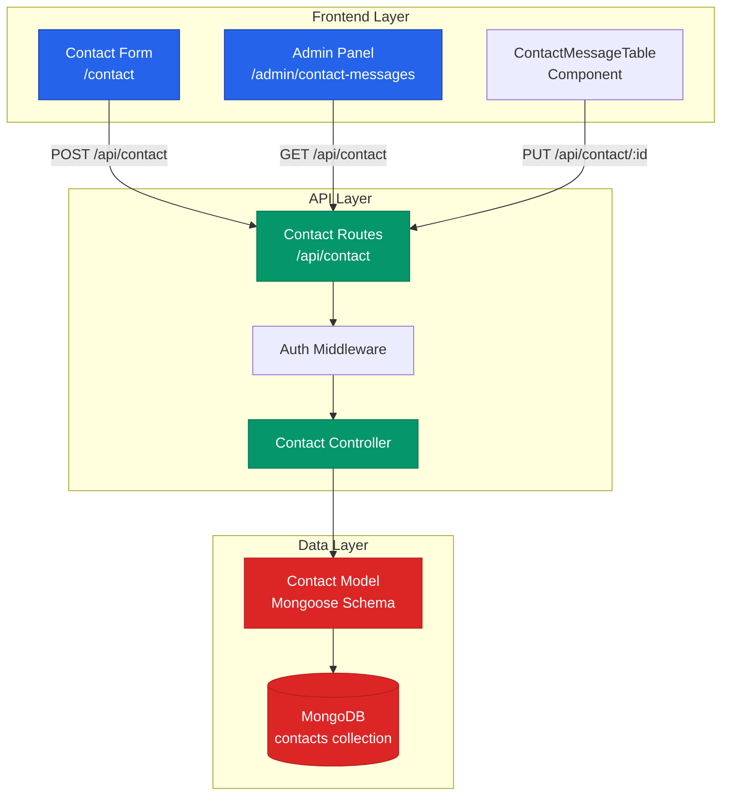
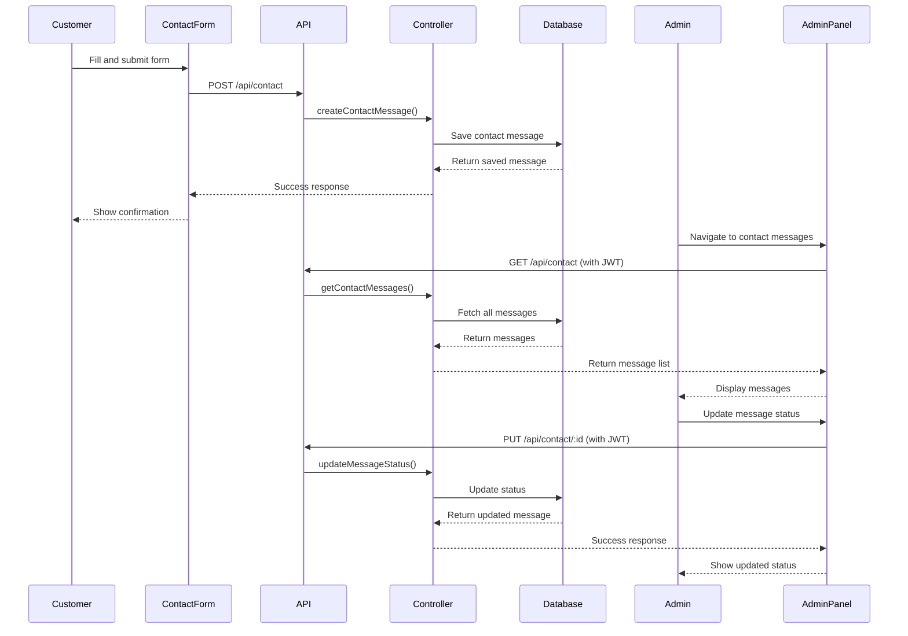

# Design Document: Admin Contact Messages

## Overview

The Admin Contact Messages feature extends the existing admin panel to capture, store, and manage customer inquiries submitted through the public contact form. This feature mirrors the architecture of the existing Custom Orders system, providing administrators with a dedicated interface to view, track, and respond to customer messages.

### Key Design Goals

1. **Data Persistence**: Transform the contact form from a static UI component into a functional system that persists customer inquiries
2. **Admin Visibility**: Provide administrators with comprehensive access to all contact messages through a dedicated admin panel section
3. **Status Tracking**: Enable administrators to track the lifecycle of each inquiry from submission to resolution
4. **Security**: Ensure contact messages are accessible only to authenticated administrators
5. **Consistency**: Maintain architectural consistency with existing features (Custom Orders, Orders) for maintainability

### System Context

The feature integrates into the existing MERN stack application:
- **Frontend**: Next.js 14 with TypeScript, React, Tailwind CSS, Framer Motion
- **Backend**: Express.js with TypeScript, MongoDB via Mongoose
- **Authentication**: JWT-based admin authentication (existing middleware)
- **API Pattern**: RESTful endpoints following established conventions

## Architecture

### High-Level Architecture



### Component Interaction Flow



### Directory Structure

```
backend/src/
├── models/
│   └── ContactMessage.ts          # New: Mongoose schema for contact messages
├── controllers/
│   └── contactController.ts       # New: Business logic for contact operations
├── routes/
│   └── contact.ts                 # New: Route definitions for contact endpoints
├── middleware/
│   └── auth.ts                    # Existing: JWT authentication middleware
└── server.ts                      # Modified: Register contact routes

frontend/
├── app/
│   ├── contact/
│   │   └── page.tsx               # Modified: Add form submission logic
│   └── admin/
│       └── contact-messages/
│           └── page.tsx           # New: Admin contact messages page
├── components/
│   └── ContactMessageTable.tsx    # New: Table component for displaying messages
└── lib/
    └── apiServices.ts             # Modified: Add contact message API functions
```

## Components and Interfaces

### Backend Components

#### 1. ContactMessage Model

**File**: `backend/src/models/ContactMessage.ts`

**Purpose**: Define the MongoDB schema and TypeScript interface for contact messages

**Schema Definition**:
```typescript
interface IContactMessage extends Document {
  customer: {
    name: string;
    email: string;
  };
  message: string;
  status: 'unread' | 'read' | 'resolved' | 'archived';
  createdAt: Date;
  updatedAt: Date;
}
```

**Key Features**:
- Embedded customer object (name, email)
- Message content field with validation
- Status enum with four states
- Automatic timestamps via Mongoose
- Index on `createdAt` for efficient sorting
- Email format validation
- Whitespace trimming on text fields

#### 2. Contact Controller

**File**: `backend/src/controllers/contactController.ts`

**Purpose**: Handle business logic for contact message operations

**Functions**:

1. `createContactMessage(req, res)` - Create new contact message
   - Validates input data (name, email, message)
   - Creates ContactMessage document with status "unread"
   - Returns success response with message ID
   - Handles validation errors with descriptive messages

2. `getContactMessages(req, res)` - Retrieve all contact messages (admin only)
   - Fetches all messages sorted by createdAt descending
   - Returns array of contact messages
   - Requires authentication

3. `updateMessageStatus(req, res)` - Update message status (admin only)
   - Validates status value against allowed enum
   - Updates message status by ID
   - Returns updated message
   - Returns 404 if message not found
   - Requires authentication

**Error Handling**:
- Validation errors return 400 with descriptive messages
- Authentication errors return 401
- Not found errors return 404
- Server errors return 500 with error details

#### 3. Contact Routes

**File**: `backend/src/routes/contact.ts`

**Purpose**: Define API endpoints and apply middleware

**Endpoints**:
- `POST /api/contact` - Public endpoint for form submission
- `GET /api/contact` - Protected endpoint for fetching messages (admin only)
- `PUT /api/contact/:id` - Protected endpoint for status updates (admin only)

**Middleware Application**:
- GET and PUT routes use `authenticateToken` middleware
- POST route is public (no authentication required)

### Frontend Components

#### 1. Contact Form (Modified)

**File**: `frontend/app/contact/page.tsx`

**Modifications**:
- Add form state management using React hooks
- Implement form submission handler
- Call `createContactMessage` API function
- Display success/error messages to user
- Clear form on successful submission
- Add loading state during submission
- Validate required fields before submission

**Form Fields**:
- Name (text input, required)
- Email (email input, required, format validation)
- Message (textarea, required, minimum length)

#### 2. Admin Contact Messages Page

**File**: `frontend/app/admin/contact-messages/page.tsx`

**Purpose**: Admin interface for viewing and managing contact messages

**Features**:
- Protected route using `ProtectedRoute` component
- Fetch messages on component mount
- Display statistics cards (unread, read, resolved, archived counts)
- Render `ContactMessageTable` component
- Refresh button to reload messages
- Loading state with spinner
- Error state with error message display
- Responsive layout matching existing admin pages

**Statistics Calculation**:
- Count messages by status from fetched data
- Display in KPI cards similar to Custom Orders page
- Update automatically when messages are loaded

#### 3. ContactMessageTable Component

**File**: `frontend/components/ContactMessageTable.tsx`

**Purpose**: Display contact messages in tabular format with status management

**Features**:
- Desktop table view (lg+ breakpoint)
- Mobile card view (< lg breakpoint)
- Display columns: Date, Customer (name + email), Message, Status
- Status dropdown for each message
- Inline status update with loading indicator
- Responsive design matching `CustomOrderTable` styling
- Empty state message when no messages exist
- Framer Motion animations for smooth rendering

**Status Management**:
- Dropdown with four status options
- Disable dropdown during update
- Show loading indicator during API call
- Display error on update failure
- Refresh parent component on successful update

### API Service Functions

**File**: `frontend/lib/apiServices.ts`

**New Types**:
```typescript
export interface ContactMessage {
  _id: string;
  customer: {
    name: string;
    email: string;
  };
  message: string;
  status: 'unread' | 'read' | 'resolved' | 'archived';
  createdAt: string;
  updatedAt: string;
}

export interface CreateContactMessageRequest {
  name: string;
  email: string;
  message: string;
}
```

**New Functions**:

1. `createContactMessage(data: CreateContactMessageRequest)` - Submit contact form
   - Public endpoint (requiresAuth: false)
   - Returns success response

2. `fetchContactMessages()` - Get all messages (admin only)
   - Protected endpoint (requiresAuth: true)
   - Returns array of ContactMessage

3. `updateContactMessageStatus(id: string, status: ContactMessage['status'])` - Update status
   - Protected endpoint (requiresAuth: true)
   - Returns updated ContactMessage

## Data Models

### ContactMessage Schema

```typescript
{
  customer: {
    name: {
      type: String,
      required: [true, 'Name is required'],
      trim: true,
      minlength: [2, 'Name must be at least 2 characters'],
      maxlength: [100, 'Name cannot exceed 100 characters']
    },
    email: {
      type: String,
      required: [true, 'Email is required'],
      trim: true,
      lowercase: true,
      match: [/^\S+@\S+\.\S+$/, 'Please provide a valid email address']
    }
  },
  message: {
    type: String,
    required: [true, 'Message is required'],
    trim: true,
    minlength: [10, 'Message must be at least 10 characters'],
    maxlength: [2000, 'Message cannot exceed 2000 characters']
  },
  status: {
    type: String,
    enum: ['unread', 'read', 'resolved', 'archived'],
    default: 'unread'
  }
},
{
  timestamps: true  // Automatically adds createdAt and updatedAt
}
```

**Indexes**:
- `createdAt: -1` - For efficient sorting (newest first)

**Validation Rules**:
- Name: Required, 2-100 characters, trimmed
- Email: Required, valid email format, lowercase, trimmed
- Message: Required, 10-2000 characters, trimmed
- Status: Must be one of the four enum values

### Database Collection

**Collection Name**: `contactmessages`

**Estimated Document Size**: ~500 bytes per message

**Growth Projection**: Assuming 50 messages/month, ~600 messages/year = ~300KB/year

**Query Patterns**:
1. Fetch all messages sorted by date (admin dashboard)
2. Update status by ID (status management)
3. Count by status (statistics calculation)

## Error Handling

### Backend Error Handling

#### Validation Errors (400)
```typescript
{
  error: true,
  message: 'Validation failed: Name is required'
}
```

**Triggers**:
- Missing required fields
- Invalid email format
- Message too short or too long
- Invalid status value

#### Authentication Errors (401)
```typescript
{
  error: true,
  message: 'Authorization header missing'
}
```

**Triggers**:
- Missing JWT token
- Invalid JWT token
- Expired JWT token

#### Not Found Errors (404)
```typescript
{
  error: true,
  message: 'Message not found'
}
```

**Triggers**:
- Attempting to update non-existent message ID

#### Server Errors (500)
```typescript
{
  error: true,
  message: 'Failed to create contact message'
}
```

**Triggers**:
- Database connection failures
- Unexpected server errors

### Frontend Error Handling

#### Form Submission Errors
- Display error message below form
- Highlight invalid fields
- Maintain form data (don't clear on error)
- Provide actionable error messages

#### API Request Errors
- Show error toast/notification
- Log errors to console for debugging
- Provide retry mechanism for transient failures
- Handle network errors gracefully

#### Status Update Errors
- Revert status dropdown to previous value
- Display error message to admin
- Log error details for troubleshooting

### Error Recovery Strategies

1. **Optimistic UI Updates**: Update UI immediately, revert on failure
2. **Retry Logic**: Implement exponential backoff for transient failures
3. **User Feedback**: Always inform users of errors with clear messages
4. **Logging**: Log all errors for monitoring and debugging

## Testing Strategy

### Unit Testing

#### Backend Unit Tests

**ContactMessage Model Tests**:
- Validate required fields enforcement
- Test email format validation
- Test message length constraints
- Test default status value
- Test timestamp generation

**Contact Controller Tests**:
- Test successful message creation
- Test validation error handling
- Test message retrieval with sorting
- Test status update logic
- Test error responses for invalid inputs

**Contact Routes Tests**:
- Test route registration
- Test middleware application
- Test authentication requirement on protected routes

#### Frontend Unit Tests

**API Service Tests**:
- Test `createContactMessage` request formatting
- Test `fetchContactMessages` authentication header
- Test `updateContactMessageStatus` request body
- Mock API responses and test error handling

**ContactMessageTable Tests**:
- Test rendering with empty message list
- Test rendering with populated message list
- Test status dropdown interaction
- Test loading state display
- Test error state display

### Integration Testing

**End-to-End Flow Tests**:
1. Submit contact form → Verify message saved in database
2. Admin login → Fetch messages → Verify correct data returned
3. Update message status → Verify database updated
4. Unauthenticated access → Verify 401 response

**API Integration Tests**:
- Test POST /api/contact with valid data
- Test POST /api/contact with invalid data
- Test GET /api/contact with authentication
- Test GET /api/contact without authentication
- Test PUT /api/contact/:id with valid status
- Test PUT /api/contact/:id with invalid status

### Manual Testing Checklist

**Contact Form**:
- [ ] Submit form with valid data
- [ ] Submit form with missing name
- [ ] Submit form with invalid email
- [ ] Submit form with short message
- [ ] Verify success message displayed
- [ ] Verify form cleared after submission

**Admin Panel**:
- [ ] Navigate to contact messages page
- [ ] Verify messages displayed in correct order
- [ ] Verify statistics cards show correct counts
- [ ] Update message status
- [ ] Verify status update reflected immediately
- [ ] Test refresh button
- [ ] Test responsive layout on mobile

**Security**:
- [ ] Attempt to access admin page without login
- [ ] Attempt to call GET /api/contact without token
- [ ] Attempt to call PUT /api/contact/:id without token
- [ ] Verify redirect to login page

### Test Coverage Goals

- **Backend**: 80% code coverage minimum
- **Frontend Components**: 70% code coverage minimum
- **API Services**: 90% code coverage minimum


## Implementation Notes

### Backend Implementation Order

1. **Create ContactMessage Model** (`backend/src/models/ContactMessage.ts`)
   - Define schema with validation rules
   - Add indexes for performance
   - Export TypeScript interface

2. **Create Contact Controller** (`backend/src/controllers/contactController.ts`)
   - Implement `createContactMessage` function
   - Implement `getContactMessages` function
   - Implement `updateMessageStatus` function
   - Add comprehensive error handling

3. **Create Contact Routes** (`backend/src/routes/contact.ts`)
   - Define route handlers
   - Apply authentication middleware to protected routes
   - Export router

4. **Register Routes in Server** (`backend/src/server.ts`)
   - Import contact routes
   - Register at `/api/contact` path

### Frontend Implementation Order

1. **Update API Services** (`frontend/lib/apiServices.ts`)
   - Add ContactMessage type definitions
   - Implement `createContactMessage` function
   - Implement `fetchContactMessages` function
   - Implement `updateContactMessageStatus` function

2. **Create ContactMessageTable Component** (`frontend/components/ContactMessageTable.tsx`)
   - Implement desktop table layout
   - Implement mobile card layout
   - Add status dropdown with update logic
   - Add loading and error states
   - Apply styling consistent with CustomOrderTable

3. **Create Admin Contact Messages Page** (`frontend/app/admin/contact-messages/page.tsx`)
   - Set up protected route
   - Implement data fetching
   - Calculate and display statistics
   - Render ContactMessageTable
   - Add refresh functionality

4. **Update Contact Form** (`frontend/app/contact/page.tsx`)
   - Add form state management
   - Implement submission handler
   - Add validation
   - Display success/error messages
   - Clear form on success

5. **Update Admin Sidebar** (`frontend/components/AdminSidebar.tsx`)
   - Add navigation link to contact messages page

### Configuration Changes

**Environment Variables**: No new environment variables required

**Dependencies**: No new dependencies required (all existing packages support this feature)

### Migration Considerations

**Database Migration**: Not required - MongoDB will automatically create the collection on first insert

**Backward Compatibility**: This is a new feature with no breaking changes to existing functionality

### Performance Considerations

1. **Database Queries**:
   - Index on `createdAt` ensures efficient sorting
   - Consider pagination if message volume exceeds 1000 messages

2. **Frontend Rendering**:
   - Use React.memo for ContactMessageTable if performance issues arise
   - Consider virtualization for very long message lists

3. **API Response Size**:
   - Current design fetches all messages
   - Consider implementing pagination if message count grows significantly

### Security Considerations

1. **Input Validation**:
   - Server-side validation for all inputs
   - Email format validation
   - Message length limits to prevent abuse

2. **Authentication**:
   - JWT token required for admin endpoints
   - Token verification on every protected request

3. **Data Sanitization**:
   - Trim whitespace from all text inputs
   - Lowercase email addresses for consistency

4. **Rate Limiting** (Future Enhancement):
   - Consider adding rate limiting to POST /api/contact to prevent spam
   - Implement CAPTCHA for additional protection

### Monitoring and Observability

**Metrics to Track**:
- Contact form submission rate
- Failed submission rate (validation errors)
- Average response time for admin queries
- Message status distribution

**Logging**:
- Log all contact message creations
- Log status updates with admin ID
- Log authentication failures

### Future Enhancements

1. **Email Notifications**:
   - Send email to admin on new message submission
   - Send confirmation email to customer

2. **Message Threading**:
   - Allow admins to reply to messages
   - Track conversation history

3. **Search and Filtering**:
   - Search messages by customer name or email
   - Filter by status
   - Date range filtering

4. **Pagination**:
   - Implement cursor-based pagination for large datasets
   - Add page size configuration

5. **Export Functionality**:
   - Export messages to CSV
   - Generate reports

6. **Analytics Dashboard**:
   - Message volume trends
   - Response time metrics
   - Customer satisfaction tracking

## Acceptance Criteria Mapping

### Requirement 1: Store Contact Form Submissions
**Testing Approach**: Unit tests + Integration tests
- Unit test: Model validation rules
- Unit test: Controller input validation
- Integration test: End-to-end form submission flow

### Requirement 2: Display Contact Messages in Admin Panel
**Testing Approach**: Component tests + Integration tests
- Component test: Table rendering with mock data
- Component test: Empty state display
- Integration test: Fetch and display real data

### Requirement 3: Update Message Status
**Testing Approach**: Unit tests + Integration tests
- Unit test: Status validation logic
- Component test: Dropdown interaction
- Integration test: Status update flow

### Requirement 4: Secure Admin Access
**Testing Approach**: Integration tests
- Integration test: Unauthenticated access blocked
- Integration test: Authenticated access allowed
- Integration test: Invalid token rejected

### Requirement 5: Display Message Statistics
**Testing Approach**: Unit tests
- Unit test: Statistics calculation logic
- Component test: Statistics display

### Requirement 6: Backend API Endpoints
**Testing Approach**: Integration tests
- Integration test: POST /api/contact
- Integration test: GET /api/contact
- Integration test: PUT /api/contact/:id

### Requirement 7: Database Schema
**Testing Approach**: Unit tests
- Unit test: Schema validation
- Unit test: Index creation
- Unit test: Default values

## Design Decisions and Rationale

### Decision 1: Embedded Customer Object vs. Separate Collection

**Decision**: Use embedded customer object in ContactMessage document

**Rationale**:
- Contact messages are independent inquiries, not linked to user accounts
- No need for customer data normalization
- Simpler queries (no joins required)
- Consistent with CustomOrder model pattern
- Customer data is small and doesn't change

**Trade-offs**:
- Cannot easily query all messages from a specific customer
- Duplicate customer data if same person submits multiple times
- Acceptable for this use case as messages are independent

### Decision 2: Status Enum Values

**Decision**: Use four status values: unread, read, resolved, archived

**Rationale**:
- **unread**: Initial state, indicates new message requiring attention
- **read**: Admin has viewed the message
- **resolved**: Inquiry has been addressed
- **archived**: Message is no longer active but preserved for records
- Provides clear workflow progression
- Allows filtering and statistics by status

**Alternative Considered**: Boolean flags (isRead, isResolved)
- Rejected because less clear workflow
- Harder to query and filter
- Less extensible

### Decision 3: Public POST Endpoint

**Decision**: Allow unauthenticated POST requests to /api/contact

**Rationale**:
- Contact form must be accessible to public users
- Authentication would prevent customers from submitting inquiries
- Validation and rate limiting provide sufficient protection
- Standard pattern for contact forms

**Security Measures**:
- Server-side validation
- Input sanitization
- Future: Rate limiting and CAPTCHA

### Decision 4: No Pagination Initially

**Decision**: Fetch all messages without pagination in initial implementation

**Rationale**:
- Simpler initial implementation
- Expected message volume is low (< 1000 messages)
- Performance impact is minimal for small datasets
- Can add pagination later if needed

**When to Add Pagination**:
- Message count exceeds 1000
- Admin page load time exceeds 2 seconds
- Database query time exceeds 500ms

### Decision 5: Reuse Existing Authentication

**Decision**: Use existing JWT authentication middleware without modifications

**Rationale**:
- Consistent with other admin features
- No need to reinvent authentication
- Reduces implementation complexity
- Maintains security standards

### Decision 6: Similar UI to Custom Orders

**Decision**: Model admin interface after existing Custom Orders page

**Rationale**:
- Consistent user experience
- Familiar interface for administrators
- Reuse styling patterns and components
- Faster development
- Easier maintenance

## Conclusion

This design document provides a comprehensive blueprint for implementing the Admin Contact Messages feature. The architecture follows established patterns in the codebase, ensuring consistency and maintainability. The feature is scoped appropriately for initial implementation while allowing for future enhancements.

**Key Success Factors**:
1. Consistent architecture with existing features
2. Comprehensive error handling
3. Secure authentication and authorization
4. Responsive and intuitive UI
5. Thorough testing coverage

**Implementation Estimate**: 8-12 hours for a single developer
- Backend: 3-4 hours
- Frontend: 4-6 hours
- Testing: 2-3 hours

**Dependencies**: None - all required infrastructure exists

**Risks**: Low - straightforward CRUD feature with established patterns
