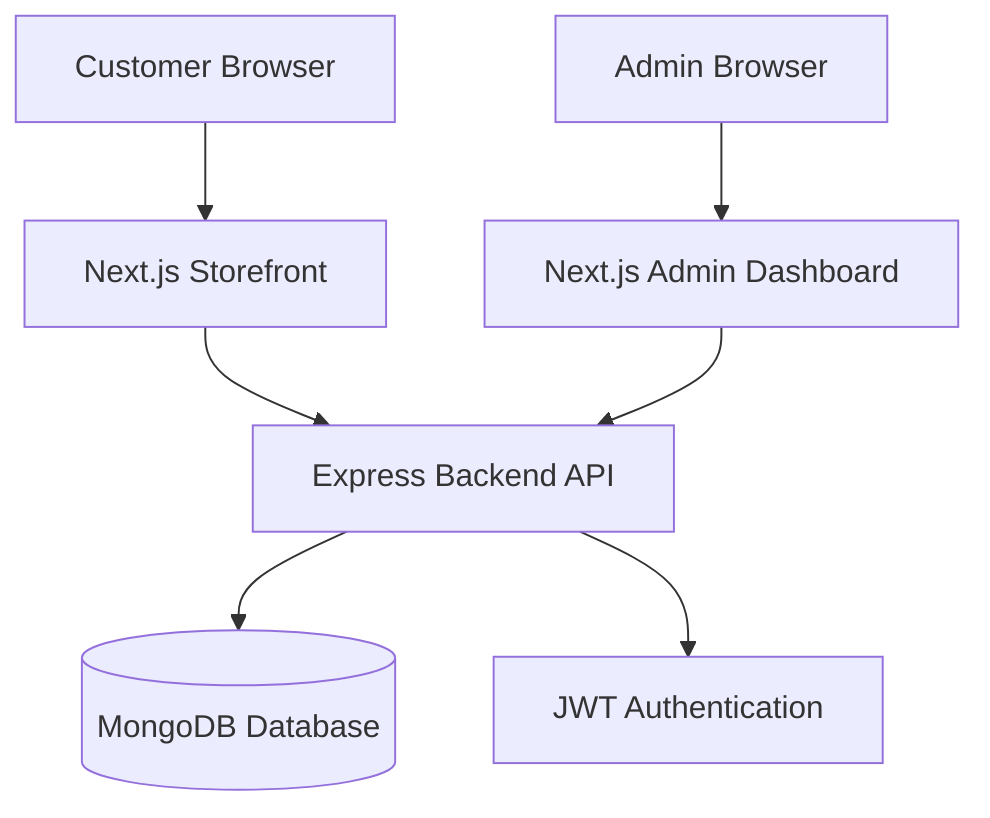
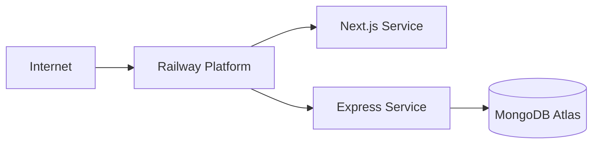

# Design Document: Wall Decoration E-Commerce Platform

## Overview

This design document specifies the technical architecture and implementation details for a wall decoration e-commerce platform specializing in car-themed wall art (Audi, BMW, Mercedes designs). The system comprises three main components:

1. **Customer Storefront**: A Next.js application providing product browsing, cart management, and checkout functionality
2. **Admin Dashboard**: A protected Next.js interface for order management and status tracking
3. **Backend API**: A Node.js/Express REST API with MongoDB for data persistence

The platform follows a modern JAMstack architecture with server-side rendering capabilities, RESTful API design, and JWT-based authentication for admin access.

## Architecture

### System Architecture



### Technology Stack

**Frontend (Storefront & Admin Dashboard)**
- Framework: Next.js 14+ with App Router
- Language: TypeScript
- Styling: Tailwind CSS for modern, responsive UI
- State Management: React Context API for cart state
- HTTP Client: Fetch API with error handling
- Authentication: JWT token storage in localStorage/cookies

**Backend API**
- Runtime: Node.js 18+
- Framework: Express.js
- Language: TypeScript
- Database Driver: Mongoose ODM
- Authentication: jsonwebtoken library
- Validation: express-validator
- Security: helmet, cors middleware

**Database**
- Database: MongoDB
- Hosting: MongoDB Atlas (cloud) or local instance
- Schema: Mongoose schemas for Products and Orders

**Deployment**
- Platform: Railway
- Environment: Production-ready with environment variables
- Configuration: Separate frontend and backend services

### Deployment Architecture



## Components and Interfaces

### Frontend Components

#### 1. Storefront Application

**Pages**
- `/` - Homepage with product display
- `/cart` - Shopping cart view
- `/checkout` - Checkout form
- `/contact` - Contact information page
- `/admin/login` - Admin authentication

**Key Components**
- `ProductCard` - Displays individual product with image, name, price, and add-to-cart button
- `ProductGrid` - Renders the 3 products in a responsive grid layout
- `Cart` - Shows cart items, quantities, and total price
- `CheckoutForm` - Collects customer information (name, phone, address)
- `Navigation` - Site navigation with links to cart and contact page

**State Management**
- Cart Context: Manages cart state (add, remove, calculate total)
- Auth Context: Manages admin authentication state and JWT token

#### 2. Admin Dashboard Application

**Pages**
- `/admin/login` - Admin login form
- `/admin/dashboard` - Order management table

**Key Components**
- `LoginForm` - Email/password input with validation
- `OrderTable` - Displays all orders with customer details and status
- `OrderRow` - Individual order with action buttons (Confirm, Deliver, Cancel)
- `ProtectedRoute` - HOC for authentication guard

### Backend API Structure

**Directory Structure**
```
backend/
├── src/
│   ├── models/
│   │   ├── Product.ts
│   │   └── Order.ts
│   ├── routes/
│   │   ├── auth.ts
│   │   ├── orders.ts
│   │   └── products.ts
│   ├── middleware/
│   │   ├── auth.ts
│   │   └── errorHandler.ts
│   ├── controllers/
│   │   ├── authController.ts
│   │   ├── orderController.ts
│   │   └── productController.ts
│   ├── config/
│   │   └── database.ts
│   └── server.ts
├── .env
└── package.json
```

**API Endpoints**

| Method | Endpoint | Auth Required | Description |
|--------|----------|---------------|-------------|
| POST | `/api/admin/login` | No | Admin authentication |
| GET | `/api/products` | No | Retrieve all products |
| POST | `/api/orders` | No | Create new order from checkout |
| GET | `/api/orders` | Yes (JWT) | Retrieve all orders (admin) |
| PUT | `/api/orders/:id` | Yes (JWT) | Update order status (admin) |

**Middleware Chain**
1. CORS configuration (allow frontend origin)
2. Helmet security headers
3. JSON body parser
4. Request logging
5. JWT authentication (protected routes)
6. Error handling

### API Request/Response Formats

**POST /api/admin/login**
```typescript
Request:
{
  email: string;
  password: string;
}

Response (Success):
{
  token: string;
  admin: {
    id: string;
    email: string;
  }
}

Response (Error):
{
  error: string;
  message: "Invalid credentials"
}
```

**GET /api/products**
```typescript
Response:
{
  products: [
    {
      _id: string;
      name: string;
      price: number;
      image: string;
      description?: string;
    }
  ]
}
```

**POST /api/orders**
```typescript
Request:
{
  customer: {
    firstName: string;
    lastName: string;
    phone: string;
    address: string;
  };
  products: [
    {
      productId: string;
      name: string;
      price: number;
      quantity: number;
    }
  ];
  totalPrice: number;
  paymentMethod: "Cash on Delivery";
}

Response (Success):
{
  success: true;
  orderId: string;
  message: "Order created successfully"
}
```

**GET /api/orders** (Admin only)
```typescript
Response:
{
  orders: [
    {
      _id: string;
      customer: {
        firstName: string;
        lastName: string;
        phone: string;
        address: string;
      };
      products: Array<{
        productId: string;
        name: string;
        price: number;
        quantity: number;
      }>;
      totalPrice: number;
      status: "pending" | "confirmed" | "delivered" | "cancelled";
      createdAt: Date;
      updatedAt: Date;
    }
  ]
}
```

**PUT /api/orders/:id** (Admin only)
```typescript
Request:
{
  status: "confirmed" | "delivered" | "cancelled";
}

Response (Success):
{
  success: true;
  order: { /* updated order object */ }
}
```

## Data Models

### Product Schema

```typescript
interface IProduct {
  _id: ObjectId;
  name: string;           // e.g., "Audi Wall Art"
  price: number;          // Price in currency units
  image: string;          // URL or path to product image
  description?: string;   // Optional product description
  category: string;       // e.g., "Audi", "BMW", "Mercedes"
  inStock: boolean;       // Availability status
  createdAt: Date;
  updatedAt: Date;
}
```

**Mongoose Schema**
```typescript
const ProductSchema = new Schema({
  name: { type: String, required: true },
  price: { type: Number, required: true, min: 0 },
  image: { type: String, required: true },
  description: { type: String },
  category: { type: String, required: true },
  inStock: { type: Boolean, default: true },
}, { timestamps: true });
```

### Order Schema

```typescript
interface IOrder {
  _id: ObjectId;
  customer: {
    firstName: string;
    lastName: string;
    phone: string;
    address: string;
  };
  products: Array<{
    productId: ObjectId;
    name: string;
    price: number;
    quantity: number;
  }>;
  totalPrice: number;
  paymentMethod: "Cash on Delivery";
  status: "pending" | "confirmed" | "delivered" | "cancelled";
  createdAt: Date;
  updatedAt: Date;
}
```

**Mongoose Schema**
```typescript
const OrderSchema = new Schema({
  customer: {
    firstName: { type: String, required: true },
    lastName: { type: String, required: true },
    phone: { type: String, required: true },
    address: { type: String, required: true }
  },
  products: [{
    productId: { type: Schema.Types.ObjectId, ref: 'Product', required: true },
    name: { type: String, required: true },
    price: { type: Number, required: true },
    quantity: { type: Number, required: true, min: 1 }
  }],
  totalPrice: { type: Number, required: true, min: 0 },
  paymentMethod: { type: String, default: "Cash on Delivery" },
  status: { 
    type: String, 
    enum: ["pending", "confirmed", "delivered", "cancelled"],
    default: "pending"
  }
}, { timestamps: true });
```

### Admin Schema

```typescript
interface IAdmin {
  _id: ObjectId;
  email: string;
  password: string;  // Hashed with bcrypt
  createdAt: Date;
  updatedAt: Date;
}
```

**Mongoose Schema**
```typescript
const AdminSchema = new Schema({
  email: { type: String, required: true, unique: true },
  password: { type: String, required: true }  // Store hashed password
}, { timestamps: true });
```

### Database Indexes

```typescript
// Orders: Index for efficient sorting by creation date
OrderSchema.index({ createdAt: -1 });

// Orders: Index for status filtering
OrderSchema.index({ status: 1 });

// Products: Index for category filtering
ProductSchema.index({ category: 1 });

// Admin: Unique index on email
AdminSchema.index({ email: 1 }, { unique: true });
```


## Error Handling

### Frontend Error Handling

**API Request Errors**
```typescript
// Centralized API error handler
async function apiRequest<T>(
  url: string, 
  options?: RequestInit
): Promise<T> {
  try {
    const response = await fetch(url, options);
    
    if (!response.ok) {
      const error = await response.json();
      throw new Error(error.message || 'Request failed');
    }
    
    return await response.json();
  } catch (error) {
    if (error instanceof Error) {
      // Network error or parsing error
      console.error('API Error:', error.message);
      throw error;
    }
    throw new Error('Unknown error occurred');
  }
}
```

**Form Validation Errors**
- Display inline validation messages for empty required fields
- Prevent form submission until all validations pass
- Show user-friendly error messages near input fields

**User-Facing Error Messages**
- Network errors: "Unable to connect. Please check your internet connection."
- Order submission failure: "Failed to place order. Please try again."
- Authentication failure: "Invalid email or password."
- Generic errors: "Something went wrong. Please try again later."

**Error UI Components**
- Toast notifications for transient errors
- Inline error messages for form validation
- Error boundary component to catch React errors

### Backend Error Handling

**Global Error Handler Middleware**
```typescript
interface ApiError extends Error {
  statusCode?: number;
  isOperational?: boolean;
}

function errorHandler(
  err: ApiError,
  req: Request,
  res: Response,
  next: NextFunction
) {
  const statusCode = err.statusCode || 500;
  const message = err.message || 'Internal Server Error';
  
  // Log error for debugging
  console.error(`[${new Date().toISOString()}] Error:`, {
    message: err.message,
    stack: err.stack,
    url: req.url,
    method: req.method
  });
  
  // Send error response
  res.status(statusCode).json({
    error: true,
    message: process.env.NODE_ENV === 'production' 
      ? message 
      : err.stack,
    statusCode
  });
}
```

**Specific Error Types**

1. **Validation Errors (400)**
   - Missing required fields in request body
   - Invalid data types or formats
   - Business rule violations

2. **Authentication Errors (401)**
   - Invalid credentials
   - Missing JWT token
   - Expired JWT token

3. **Authorization Errors (403)**
   - Valid token but insufficient permissions

4. **Not Found Errors (404)**
   - Order ID not found
   - Product ID not found
   - Route not found

5. **Database Errors (500)**
   - Connection failures
   - Query execution errors
   - Transaction failures

**Error Response Format**
```typescript
{
  error: true,
  message: string,
  statusCode: number,
  details?: any  // Only in development mode
}
```

**Database Error Handling**
```typescript
// Mongoose connection error handling
mongoose.connection.on('error', (err) => {
  console.error('MongoDB connection error:', err);
  process.exit(1);
});

mongoose.connection.on('disconnected', () => {
  console.warn('MongoDB disconnected. Attempting to reconnect...');
});

// Query error handling with try-catch
async function createOrder(orderData: IOrder) {
  try {
    const order = new Order(orderData);
    await order.save();
    return order;
  } catch (error) {
    if (error.name === 'ValidationError') {
      throw new ApiError('Invalid order data', 400);
    }
    throw new ApiError('Failed to create order', 500);
  }
}
```

**JWT Error Handling**
```typescript
function verifyToken(token: string) {
  try {
    return jwt.verify(token, process.env.JWT_SECRET!);
  } catch (error) {
    if (error.name === 'TokenExpiredError') {
      throw new ApiError('Token expired', 401);
    }
    if (error.name === 'JsonWebTokenError') {
      throw new ApiError('Invalid token', 401);
    }
    throw new ApiError('Authentication failed', 401);
  }
}
```

## Testing Strategy

### Overview

This e-commerce platform will use a comprehensive testing strategy combining unit tests, integration tests, and end-to-end tests. Property-based testing is not applicable for this project because:

1. The application is primarily CRUD operations with database interactions
2. Most functionality involves UI rendering and user interactions
3. Business logic is straightforward without complex data transformations
4. Testing would require extensive mocking of external services (database, authentication)

Instead, we focus on:
- **Unit tests** for individual functions and components
- **Integration tests** for API endpoints and database operations
- **End-to-end tests** for critical user flows

### Testing Tools

**Frontend Testing**
- Test Runner: Jest
- Component Testing: React Testing Library
- E2E Testing: Playwright or Cypress
- Mocking: MSW (Mock Service Worker) for API mocking

**Backend Testing**
- Test Runner: Jest
- API Testing: Supertest
- Database: MongoDB Memory Server for isolated tests
- Mocking: jest.mock() for external dependencies

### Unit Tests

**Frontend Unit Tests**

1. **Component Tests**
   - ProductCard renders correctly with product data
   - Cart displays correct total price calculation
   - CheckoutForm validates required fields
   - OrderTable renders orders correctly
   - Navigation links are present and correct

2. **Utility Function Tests**
   - Cart total calculation with multiple items
   - Form validation logic
   - Date formatting functions
   - Price formatting functions

3. **Context Tests**
   - Cart context adds items correctly
   - Cart context removes items correctly
   - Cart context calculates totals accurately
   - Auth context stores and retrieves JWT token

**Example Frontend Unit Test**
```typescript
describe('Cart Context', () => {
  it('should add product to cart', () => {
    const { result } = renderHook(() => useCart());
    const product = { id: '1', name: 'Audi Art', price: 50 };
    
    act(() => {
      result.current.addToCart(product);
    });
    
    expect(result.current.cart).toHaveLength(1);
    expect(result.current.cart[0]).toEqual(product);
  });
  
  it('should calculate correct total', () => {
    const { result } = renderHook(() => useCart());
    
    act(() => {
      result.current.addToCart({ id: '1', name: 'Audi Art', price: 50 });
      result.current.addToCart({ id: '2', name: 'BMW Art', price: 60 });
    });
    
    expect(result.current.total).toBe(110);
  });
});
```

**Backend Unit Tests**

1. **Controller Tests**
   - Order creation with valid data
   - Order creation with missing fields returns 400
   - Order status update with valid status
   - Order status update with invalid status returns 400
   - Admin login with valid credentials returns token
   - Admin login with invalid credentials returns 401

2. **Middleware Tests**
   - JWT authentication middleware validates token
   - JWT authentication middleware rejects invalid token
   - JWT authentication middleware rejects missing token
   - Error handler formats errors correctly

3. **Model Tests**
   - Order model validates required fields
   - Order model sets default status to "pending"
   - Order model sets timestamps correctly
   - Product model validates price is non-negative

**Example Backend Unit Test**
```typescript
describe('Order Controller', () => {
  it('should create order with valid data', async () => {
    const orderData = {
      customer: {
        firstName: 'John',
        lastName: 'Doe',
        phone: '1234567890',
        address: '123 Main St'
      },
      products: [{ productId: 'prod1', name: 'Audi Art', price: 50, quantity: 1 }],
      totalPrice: 50
    };
    
    const response = await request(app)
      .post('/api/orders')
      .send(orderData)
      .expect(201);
    
    expect(response.body.success).toBe(true);
    expect(response.body.orderId).toBeDefined();
  });
  
  it('should return 400 for missing customer data', async () => {
    const invalidData = {
      products: [{ productId: 'prod1', name: 'Audi Art', price: 50, quantity: 1 }],
      totalPrice: 50
    };
    
    const response = await request(app)
      .post('/api/orders')
      .send(invalidData)
      .expect(400);
    
    expect(response.body.error).toBe(true);
  });
});
```

### Integration Tests

**API Integration Tests**

Test complete request-response cycles with real database operations (using MongoDB Memory Server):

1. **Order Flow**
   - Create order → verify in database
   - Retrieve orders → verify correct data returned
   - Update order status → verify status changed in database
   - Orders sorted by creation date (newest first)

2. **Authentication Flow**
   - Login with valid credentials → receive JWT token
   - Access protected route with token → success
   - Access protected route without token → 401 error
   - Access protected route with expired token → 401 error

3. **Product Flow**
   - Retrieve products → verify 3 products returned
   - Each product has required fields (name, price, image)

**Example Integration Test**
```typescript
describe('Order API Integration', () => {
  let mongoServer: MongoMemoryServer;
  let token: string;
  
  beforeAll(async () => {
    mongoServer = await MongoMemoryServer.create();
    await mongoose.connect(mongoServer.getUri());
    
    // Create admin and get token
    const admin = await Admin.create({
      email: 'admin@test.com',
      password: await bcrypt.hash('password', 10)
    });
    token = jwt.sign({ id: admin._id }, process.env.JWT_SECRET!);
  });
  
  afterAll(async () => {
    await mongoose.disconnect();
    await mongoServer.stop();
  });
  
  it('should create and retrieve order', async () => {
    // Create order
    const orderData = { /* ... */ };
    const createResponse = await request(app)
      .post('/api/orders')
      .send(orderData)
      .expect(201);
    
    const orderId = createResponse.body.orderId;
    
    // Retrieve orders
    const getResponse = await request(app)
      .get('/api/orders')
      .set('Authorization', `Bearer ${token}`)
      .expect(200);
    
    expect(getResponse.body.orders).toHaveLength(1);
    expect(getResponse.body.orders[0]._id).toBe(orderId);
  });
});
```

### End-to-End Tests

**Critical User Flows**

1. **Customer Purchase Flow**
   - Navigate to homepage
   - View 3 products displayed
   - Add product to cart
   - View cart with correct total
   - Navigate to checkout
   - Fill out customer information
   - Submit order
   - See confirmation message

2. **Admin Order Management Flow**
   - Navigate to admin login
   - Enter credentials and login
   - Redirected to dashboard
   - View orders in table
   - Click "Confirm" on pending order
   - Verify status updated to "confirmed"
   - Click "Deliver" on confirmed order
   - Verify status updated to "delivered"

3. **Error Handling Flows**
   - Submit checkout with empty fields → see validation errors
   - Login with invalid credentials → see error message
   - Access admin dashboard without login → redirected to login

**Example E2E Test (Playwright)**
```typescript
test('customer can complete purchase', async ({ page }) => {
  // Navigate to homepage
  await page.goto('/');
  
  // Verify products displayed
  await expect(page.locator('[data-testid="product-card"]')).toHaveCount(3);
  
  // Add product to cart
  await page.locator('[data-testid="add-to-cart"]').first().click();
  
  // Navigate to cart
  await page.locator('[data-testid="cart-link"]').click();
  await expect(page.locator('[data-testid="cart-item"]')).toHaveCount(1);
  
  // Go to checkout
  await page.locator('[data-testid="checkout-button"]').click();
  
  // Fill form
  await page.fill('[name="firstName"]', 'John');
  await page.fill('[name="lastName"]', 'Doe');
  await page.fill('[name="phone"]', '1234567890');
  await page.fill('[name="address"]', '123 Main St');
  
  // Submit order
  await page.locator('[data-testid="submit-order"]').click();
  
  // Verify confirmation
  await expect(page.locator('text=We will contact you shortly')).toBeVisible();
});
```

### Test Coverage Goals

- **Unit Tests**: 80%+ code coverage for business logic
- **Integration Tests**: All API endpoints covered
- **E2E Tests**: All critical user flows covered

### Continuous Integration

Tests should run automatically on:
- Every pull request
- Before deployment to production
- Scheduled nightly runs for E2E tests

**CI Pipeline**
1. Lint code (ESLint, Prettier)
2. Run unit tests
3. Run integration tests
4. Run E2E tests (on staging environment)
5. Build application
6. Deploy if all tests pass

### Manual Testing Checklist

Before production deployment:
- [ ] Test on multiple browsers (Chrome, Firefox, Safari)
- [ ] Test on mobile devices (responsive design)
- [ ] Test with slow network conditions
- [ ] Verify all error messages are user-friendly
- [ ] Test admin authentication and authorization
- [ ] Verify order creation and status updates
- [ ] Test cart functionality with multiple items
- [ ] Verify contact page displays correctly

